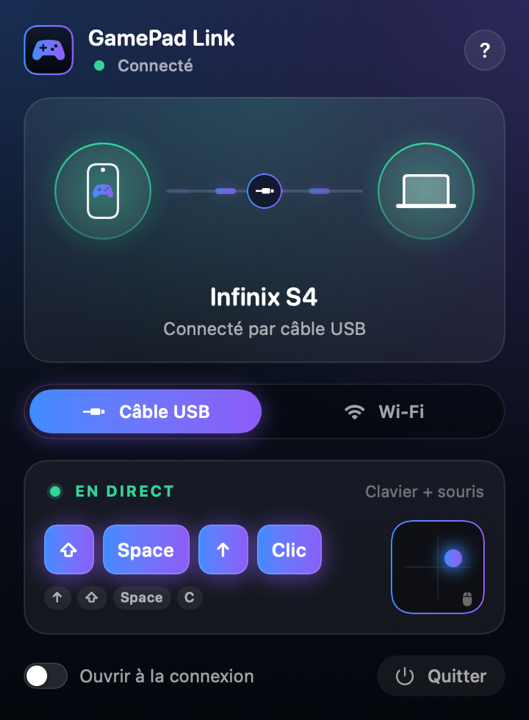
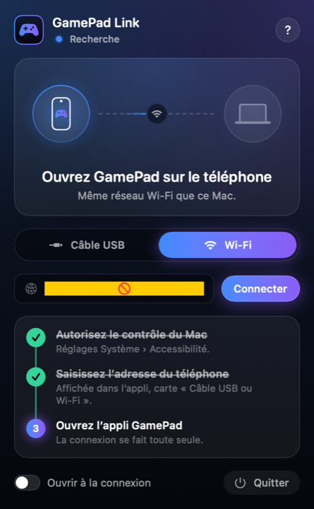

# GamePad Link for Mac

**Use your Android phone as a game controller on your Mac, over Wi‑Fi or a USB cable.**

GamePad Link is the free companion app for **GamePad: Smart Controller** on Android, by **AT DIGITAL STUDIO**.
It receives the controls from your phone and turns them into keyboard keys and mouse movements on your Mac.

  
  

> 🇫🇷 [Version française plus bas](#-français)

## ⬇️ Download

**[Download the latest version (GamePad-Link.dmg)](https://github.com/atdigitalstudio/gamepad-link/releases/latest/download/GamePad-Link.dmg)**

macOS 13 Ventura or later · Apple Silicon and Intel

## Install

1. Open `GamePad-Link.dmg` and drag **GamePad Link** into **Applications**.
2. Open GamePad Link from Applications. It appears in the menu bar (gamepad icon).
3. The first time, allow it in **System Settings › Privacy & Security › Accessibility**.
   This permission lets it type keys and move the mouse for your games.

## Connect your phone

### Wi‑Fi (easiest)

1. Put your phone and your Mac on the same Wi‑Fi network.
2. In the GamePad app on your phone, open **Connect a device**: it shows an address like `192.168.1.20:47800`.
3. In GamePad Link, choose **Wi‑Fi** and enter that address.

### USB cable (lowest lag)

1. On your phone, turn on **USB debugging** (Settings › Developer options).
2. In GamePad Link, choose **USB cable**. The first time, click **Install**: it downloads adb, Google's free tool for the cable (about 16 MB, once).
3. Plug the phone into your Mac and tap **Allow** on the phone. GamePad Link connects by itself.

## Need help?

- **"GamePad Link can't be opened"**: right‑click the app in Applications › **Open**, then **Open** again.
  On recent macOS: System Settings › Privacy & Security › **Open Anyway**.
- **The controls do nothing**: check that GamePad Link is allowed in Accessibility, and that the game window is in front.
- Other problem: [open an issue](https://github.com/atdigitalstudio/gamepad-link/issues).

## Privacy

GamePad Link only talks to your own phone, over your cable or your local network.
It does not collect or send any personal data, and its settings stay on your Mac.
The only Internet connection: when you click **Install** for the USB cable, it downloads adb from Google (dl.google.com).

---

## 🇫🇷 Français

**Utilisez votre téléphone Android comme manette sur votre Mac, en Wi‑Fi ou par câble USB.**

GamePad Link est l'appli compagnon gratuite de **GamePad: Smart Controller** sur Android, éditée par **AT DIGITAL STUDIO**.
Elle reçoit les commandes de votre téléphone et les transforme en touches clavier et mouvements de souris sur votre Mac.

### ⬇️ Télécharger

**[Télécharger la dernière version (GamePad-Link.dmg)](https://github.com/atdigitalstudio/gamepad-link/releases/latest/download/GamePad-Link.dmg)**

macOS 13 Ventura ou plus récent · Apple Silicon et Intel

### Installer

1. Ouvrez `GamePad-Link.dmg` et glissez **GamePad Link** dans **Applications**.
2. Ouvrez GamePad Link depuis Applications. Il apparaît dans la barre des menus (icône manette).
3. La première fois, autorisez-le dans **Réglages Système › Confidentialité et sécurité › Accessibilité**.
   Cette autorisation lui permet de taper des touches et de bouger la souris pour vos jeux.

### Connecter votre téléphone

**Wi‑Fi (le plus simple)**

1. Mettez le téléphone et le Mac sur le même réseau Wi‑Fi.
2. Dans l'appli GamePad du téléphone, ouvrez **Connecter un appareil** : une adresse du type `192.168.1.20:47800` s'affiche.
3. Dans GamePad Link, choisissez **Wi‑Fi** et saisissez cette adresse.

**Câble USB (le plus réactif)**

1. Sur le téléphone, activez le **débogage USB** (Paramètres › Options pour les développeurs).
2. Dans GamePad Link, choisissez **Câble USB**. La première fois, cliquez sur **Installer** : il télécharge adb, l'outil gratuit de Google pour le câble (environ 16 Mo, une seule fois).
3. Branchez le téléphone au Mac et touchez **Autoriser** sur le téléphone. GamePad Link se connecte tout seul.

### Besoin d'aide ?

- **« Impossible d'ouvrir GamePad Link »** : clic droit sur l'appli dans Applications › **Ouvrir**, puis **Ouvrir** à nouveau.
  Sur les macOS récents : Réglages Système › Confidentialité et sécurité › **Ouvrir quand même**.
- **Les commandes ne font rien** : vérifiez que GamePad Link est autorisé dans Accessibilité et que la fenêtre du jeu est au premier plan.
- Autre problème : [signalez-le ici](https://github.com/atdigitalstudio/gamepad-link/issues).

### Confidentialité

GamePad Link communique uniquement avec votre propre téléphone, par câble ou sur votre réseau local.
Il ne collecte et n'envoie aucune donnée personnelle, et ses réglages restent sur votre Mac.
Seule connexion à Internet : quand vous cliquez sur **Installer** pour le câble USB, il télécharge adb chez Google (dl.google.com).

---

© 2026 AT DIGITAL STUDIO · [www.atdigitalstudio.com](https://www.atdigitalstudio.com)
